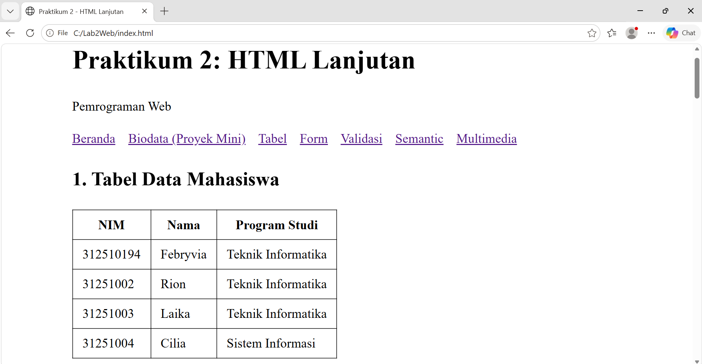
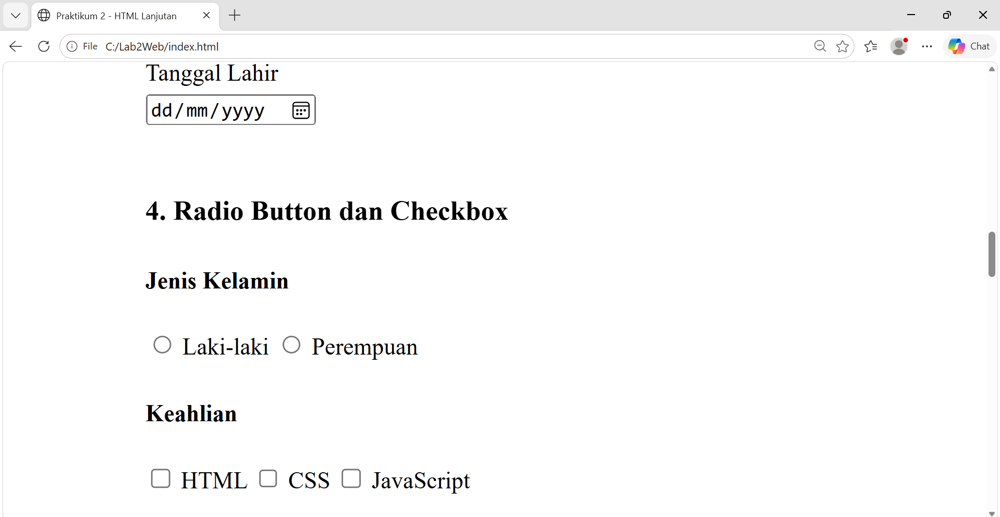
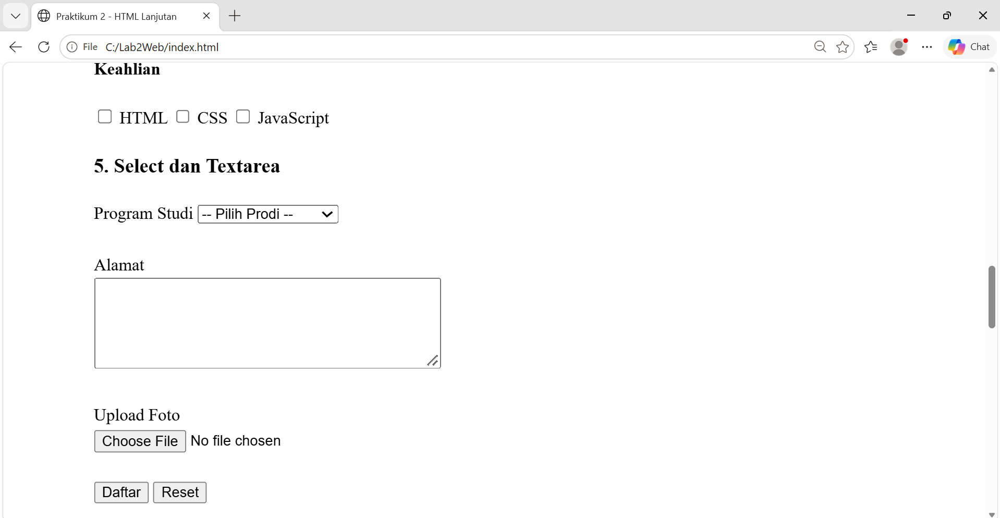
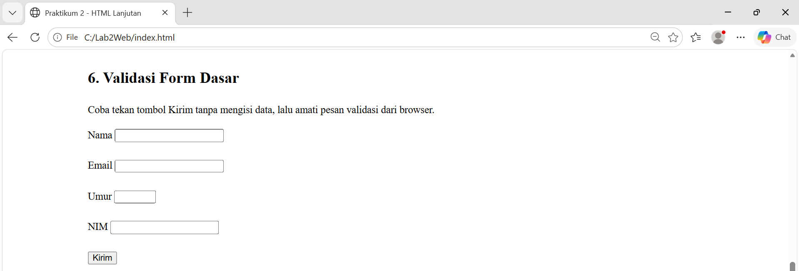
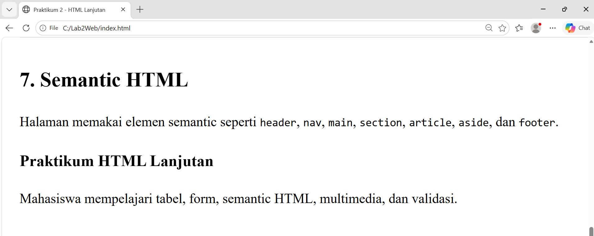
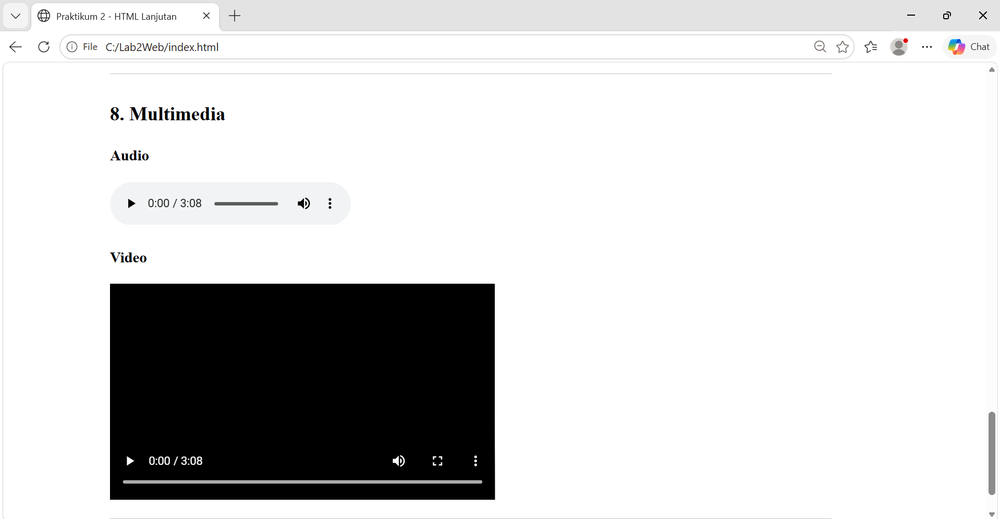

# Lab2Web - Praktikum 2: HTML Lanjutan

**Mata Kuliah:** Pemrograman Web

**Nama:** Febryvia Deya Nur Havidtar Murti Aqsa

**Kelas:** I251B

**Program Studi:** Teknik Informatika

## Deskripsi

Repository ini berisi hasil Praktikum 2 (HTML Lanjutan) yang meliputi tabel, form dan berbagai jenis input, semantic HTML, multimedia, dan validasi form dasar.

## Struktur Folder

```
Lab2Web/
├── index.html      
├── biodata.html    
├── media/
│   ├── audio.mp3
│   └── video.mp4
└── README.md
```

## Langkah-langkah Praktikum

### 1. Membuat Tabel Data Mahasiswa
Membuat tabel dengan `<table>`, `<tr>`, `<th>`, `<td>` berisi NIM, Nama, dan Program Studi (minimal tiga data).



### 2. Tabel dengan thead, tbody, dan tfoot
Menambahkan `<caption>`, `<thead>`, `<tbody>`, `<tfoot>`, serta `colspan="2"` pada baris rata-rata.


### 3. Form Registrasi Mahasiswa
Membuat form dengan input `text`, `email`, `password`, `date`, tombol `submit` dan `reset`, semuanya dihubungkan dengan `<label for="...">`.


### 4. Radio Button dan Checkbox
Radio button untuk jenis kelamin (satu pilihan, `name` sama) dan checkbox untuk keahlian (boleh lebih dari satu).



### 5. Select dan Textarea
Membuat dropdown program studi dengan `<select>` dan kolom alamat dengan `<textarea>`.



### 6. Validasi Form Dasar
Menggunakan atribut `required`, `minlength`, `min`, `max`, `pattern`, dan `type`. Saat tombol Kirim ditekan tanpa mengisi data, browser menampilkan pesan validasi.



### 7. Halaman Semantic HTML
Menyusun halaman dengan `<header>`, `<nav>`, `<main>`, `<section>`, `<article>`, `<aside>`, dan `<footer>`.



### 8. Menambahkan Multimedia
Menambahkan `<audio controls>` dan `<video controls>` dengan file dari folder `media/`.



### 9. Proyek Mini - Form Biodata Mahasiswa
File `biodata.html` menggabungkan semantic structure, tabel data, form, validasi dasar, dan elemen video.


## Jawaban Pertanyaan

**1. Apa fungsi `<table>`, `<tr>`, `<th>`, dan `<td>`?**
`<table>` membuat struktur tabel, `<tr>` membuat baris, `<th>` membuat sel header (judul kolom/baris), dan `<td>` membuat sel data.

**2. Apa perbedaan `<th>` dan `<td>`?**
`<th>` adalah sel header yang secara default tampil tebal dan rata tengah serta bermakna sebagai judul kolom/baris. `<td>` adalah sel data biasa yang berisi isi tabel.

**3. Apa fungsi `colspan` pada tabel?**
`colspan` menggabungkan beberapa kolom menjadi satu sel. Contoh `colspan="2"` membuat sel membentang selebar dua kolom.

**4. Apa fungsi `<form>` dalam HTML?**
`<form>` adalah wadah untuk elemen input yang menerima data dari pengguna dan mengirimkannya ke server (atau ke proses lain) saat tombol submit ditekan.

**5. Apa perbedaan radio button dan checkbox?**
Radio button hanya memungkinkan satu pilihan dari satu grup (`name` sama), sedangkan checkbox memungkinkan memilih satu, beberapa, atau tidak sama sekali.

**6. Mengapa `<label>` sebaiknya terhubung dengan id input melalui atribut `for`?**
Agar label terkait dengan input-nya: mengklik label langsung memfokuskan input (atau mencentang checkbox/radio), area klik jadi lebih luas, dan pembaca layar (screen reader) bisa membacakan label yang tepat sehingga lebih aksesibel.

**7. Apa perbedaan `<textarea>` dengan input type text?**
`<input type="text">` untuk teks satu baris pendek, sedangkan `<textarea>` untuk teks panjang multi-baris dengan ukuran diatur lewat `rows` dan `cols`. `<textarea>` punya tag penutup, sedangkan `<input>` tidak.

**8. Apa fungsi semantic HTML seperti `<header>`, `<nav>`, `<main>`, `<section>`, `<article>`, `<aside>`, dan `<footer>`?**
Elemen-elemen ini memberi makna pada struktur halaman: `<header>` kepala halaman/bagian, `<nav>` navigasi, `<main>` konten utama, `<section>` kelompok konten, `<article>` konten mandiri, `<aside>` konten pelengkap, dan `<footer>` kaki halaman. Manfaatnya: kode lebih mudah dibaca, lebih baik untuk SEO dan aksesibilitas, serta lebih mudah dipelihara.

**9. Apa fungsi `required`, `min`, `max`, dan `minlength`?**
`required` mewajibkan input diisi, `min` dan `max` menentukan nilai minimum dan maksimum (untuk angka/tanggal), dan `minlength` menentukan jumlah karakter minimum pada input teks.

**10. Apa perbedaan elemen `<audio>` dan `<video>`?**
`<audio>` menampilkan pemutar suara saja (tanpa gambar), sedangkan `<video>` menampilkan gambar bergerak beserta suara, dan bisa diatur ukurannya (`width`, `height`) serta memiliki area tampilan visual.